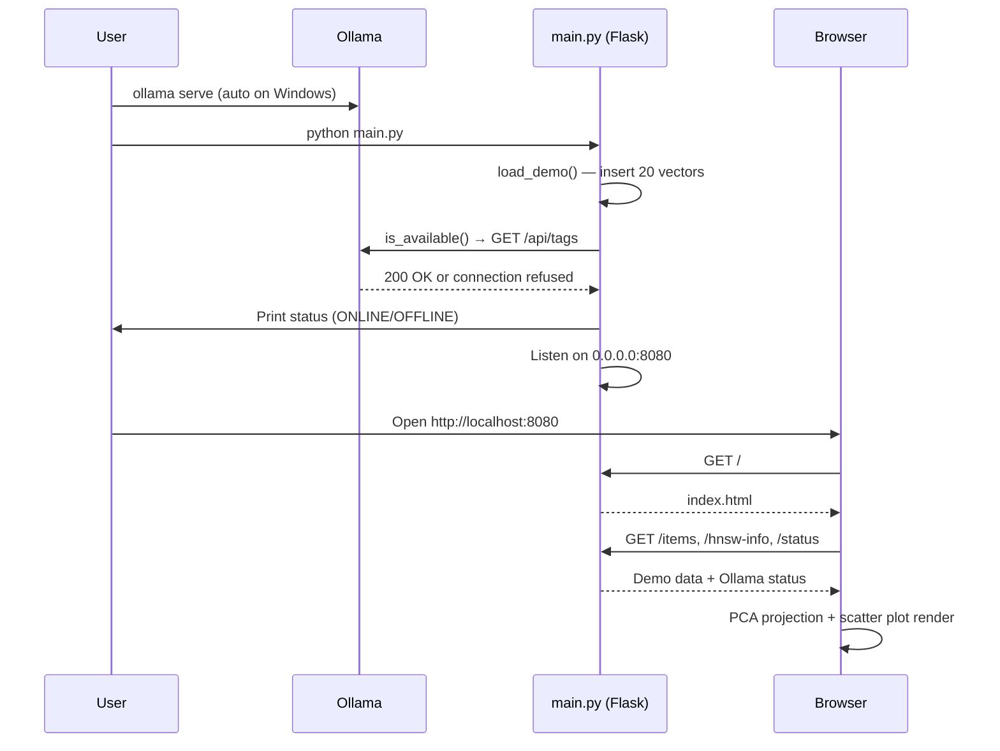
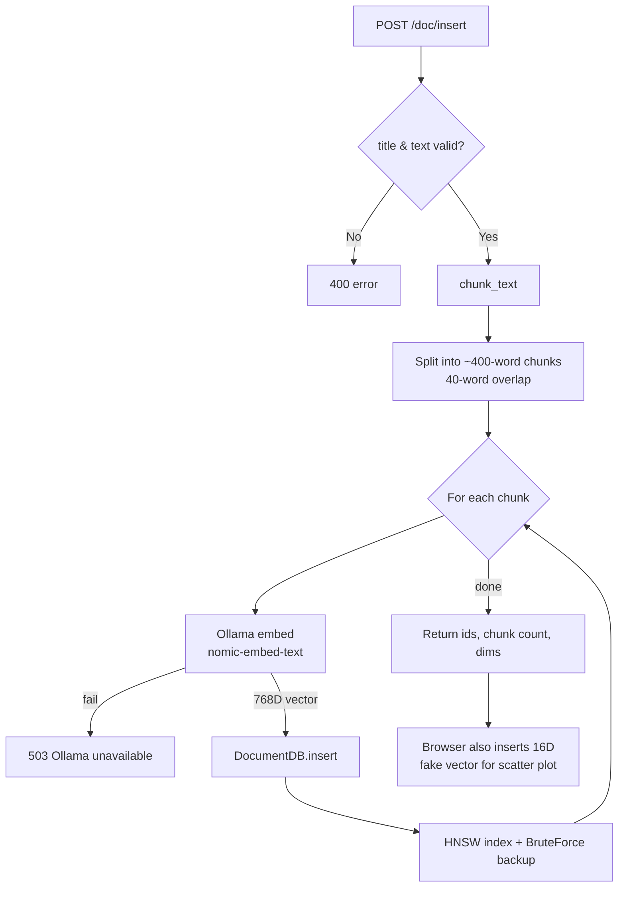
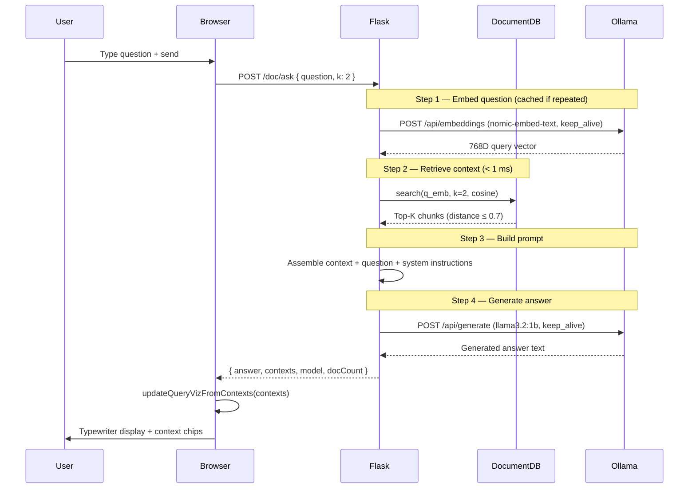

# Vex_LLM — Detailed System Workflow

**Vex_LLM** is a local vector database and RAG (Retrieval-Augmented Generation) application. It combines custom search algorithms (HNSW, KD-Tree, Brute Force) with Ollama for real document embeddings and LLM answers — all running on your machine.

---

## Table of Contents

1. [High-Level Architecture](#1-high-level-architecture)
2. [Startup Workflow](#2-startup-workflow)
3. [Workflow A — Demo Vector Search](#3-workflow-a--demo-vector-search)
4. [Workflow B — Document Ingestion](#4-workflow-b--document-ingestion)
5. [Workflow C — RAG (Ask AI)](#5-workflow-c--rag-ask-ai)
6. [Workflow D — Algorithm Benchmark](#6-workflow-d--algorithm-benchmark)
7. [Backend Components](#7-backend-components)
8. [Frontend Components](#8-frontend-components)
9. [REST API Map](#9-rest-api-map)
10. [Data Stores](#10-data-stores)
11. [External Dependencies](#11-external-dependencies)
12. [Performance & Retrieval Speed](#12-performance--retrieval-speed)

---

## 1. High-Level Architecture

```
┌─────────────────────────────────────────────────────────────────────────┐
│                         BROWSER (index.html)                            │
│  ┌──────────────┐  ┌──────────────────┐  ┌──────────────────────────┐ │
│  │ Search Tab   │  │ Documents Tab    │  │   Ask AI Tab               │ │
│  │ (16D demo)   │  │ (embed & store)  │  │ (RAG pipeline)           │ │
│  └──────┬───────┘  └────────┬─────────┘  └────────────┬─────────────┘ │
│         │                   │                          │                │
│         │    PCA Scatter Plot (center canvas)          │                │
└─────────┼───────────────────┼──────────────────────────┼────────────────┘
          │ HTTP REST           │                          │
          ▼                   ▼                          ▼
┌─────────────────────────────────────────────────────────────────────────┐
│                    Flask Server (main.py :8080)                         │
│                                                                         │
│  ┌─────────────────┐    ┌─────────────────┐    ┌────────────────────┐ │
│  │   VectorDB      │    │   DocumentDB    │    │   OllamaClient     │ │
│  │   (16D demo)    │    │   (768D real)   │    │   (HTTP client)    │ │
│  │                 │    │                 │    │                    │ │
│  │ • BruteForce    │    │ • HNSW index    │    │ • embed()          │ │
│  │ • KDTree        │    │ • BruteForce    │    │ • generate()       │ │
│  │ • HNSW          │    │   (fallback)    │    │ • is_available()   │ │
│  └─────────────────┘    └─────────────────┘    └─────────┬──────────┘ │
└────────────────────────────────────────────────────────────┼────────────┘
                                                             │ HTTP :11434
                                                             ▼
                                              ┌──────────────────────────┐
                                              │   Ollama (local)         │
                                              │                          │
                                              │  nomic-embed-text (768D) │
                                              │  llama3.2:1b (generation)│
                                              └──────────────────────────┘
```

### Two parallel vector systems

| System | Dimensions | Embedding source | Purpose |
|--------|-----------|------------------|---------|
| **VectorDB** (demo) | 16D | Keyword-based (browser) or manual | Algorithm demo, scatter plot, benchmarks |
| **DocumentDB** (RAG) | 768D | Ollama `nomic-embed-text` | Real document search and Q&A |

---

## 2. Startup Workflow



### Step-by-step

| Step | Action | Result |
|------|--------|--------|
| 1 | `ollama serve` (or system tray) | Ollama API on port **11434** |
| 2 | `python main.py` | Flask API on port **8080** |
| 3 | `load_demo()` runs at import | 20 pre-built 16D vectors loaded (CS, Math, Food, Sports) |
| 4 | Browser opens `http://localhost:8080` | UI loads; never open `index.html` as a file |
| 5 | Frontend calls `/items` | Scatter plot draws 20 points via PCA |
| 6 | Frontend calls `/status` | Header shows **OLLAMA ✓** or **OLLAMA ✗** |

---

## 3. Workflow A — Demo Vector Search

**Tab:** Search | **No Ollama required**

### User journey

1. User types a query (e.g. `"binary tree"`) in the left panel.
2. Browser converts text → **16D embedding** using keyword matching (`textToEmbedding()`).
3. Browser sends `GET /search?v=0.9,0.85,...&k=5&metric=cosine&algo=hnsw`.
4. Backend runs k-nearest-neighbor search on **VectorDB**.
5. Results return with distances and latency (microseconds).
6. UI highlights nearest points on the PCA scatter plot.

### Text → 16D embedding (browser-side)

```
Input: "binary tree algorithm"
         │
         ▼
Keyword scan against 4 category dictionaries:
  • cs     → dims 0–3   (cyan)
  • math   → dims 4–7   (purple)
  • food   → dims 8–11  (orange)
  • sports → dims 12–15 (green)
         │
         ▼
Output: [0.90, 0.85, 0.72, 0.68, 0.12, 0.08, ...]  (16 floats)
```

### Search algorithm selection

```mermaid
flowchart TD
    Q[Query vector 16D] --> A{Algorithm?}
    A -->|bruteforce| BF[Compare against ALL vectors O(N)]
    A -->|kdtree| KD[Tree traversal with pruning O(log N)]
    A -->|hnsw| HN[Graph greedy search O(log N)]
    BF --> R[Top-K results sorted by distance]
    KD --> R
    HN --> R
    R --> UI[Results panel + scatter highlight]
```

### Distance metrics

| Metric | Formula | Lower = |
|--------|---------|---------|
| Cosine | `1 - dot(a,b) / (‖a‖·‖b‖)` | More similar |
| Euclidean | `√Σ(aᵢ - bᵢ)²` | Closer |
| Manhattan | `Σ|aᵢ - bᵢ|` | Closer |

---

## 4. Workflow B — Document Ingestion

**Tab:** Documents | **Requires Ollama**

### User journey

1. User enters a **title** and pastes **text** (notes, articles, lectures).
2. Clicks **EMBED & INSERT**.
3. Frontend sends `POST /doc/insert` with `{ title, text }`.

### Backend pipeline



### Chunking details

| Parameter | Value | Purpose |
|-----------|-------|---------|
| `chunk_words` | 400 | Max words per chunk (fewer chunks = faster retrieval) |
| `overlap_words` | 40 | Overlap between chunks (context continuity) |
| Step size | 360 words | `400 - 40` |

**Example:** A 600-word document → ~2 chunks:
- `Title [1/3]`, `Title [2/3]`, `Title [3/3]`

Each chunk is embedded separately and stored as its own **DocItem** in **DocumentDB**.

### Ollama embedding call

```
POST http://127.0.0.1:11434/api/embeddings
Body: { "model": "nomic-embed-text", "prompt": "<chunk text>", "keep_alive": "30m" }
Response: { "embedding": [0.023, -0.118, ...] }  ← 768 dimensions
```

Embeddings are cached in memory by exact prompt text — repeat queries skip the Ollama round-trip.

---

## 5. Workflow C — RAG (Ask AI)

**Tab:** Ask AI | **Requires Ollama + inserted documents**

### User journey

1. User types a question (e.g. `"What is serverless computing?"`).
2. Clicks the send button.
3. Answer appears with typewriter effect and retrieved context chips.

### Full RAG pipeline



### Prompt structure sent to llama3.2:1b

```
You are a helpful assistant. Answer the user's question directly.
Use the provided context if it contains relevant information.
If it doesn't, just use your own general knowledge.
IMPORTANT: Do NOT mention the 'context', 'provided text'...

Context:
[1] Operating Systems Notes [1/3]:
<text of chunk 1>

[2] Operating Systems Notes [2/3]:
<text of chunk 2>..


Question: What is a process?

Answer:
```

### Scatter plot update (after answer)

After `/doc/ask` returns, the browser calls `updateQueryVizFromContexts()` using the **same** response contexts to highlight document chunks on the PCA scatter plot. No separate `/doc/search` call is made — this avoids embedding the question twice.

---

## 6. Workflow D — Algorithm Benchmark

**Button:** ▶ COMPARE ALL ALGOS

```
GET /benchmark?v=<16D vector>&k=5&metric=cosine
```

Backend times all three algorithms on the same query:

| Algorithm | Complexity | Index type |
|-----------|-----------|------------|
| Brute Force | O(N × d) | Linear scan |
| KD-Tree | O(log N) avg | Axis-aligned binary tree |
| HNSW | O(log N) approx | Multilayer small-world graph |

Response:
```json
{
  "bruteforceUs": 54,
  "kdtreeUs": 35,
  "hnswUs": 92,
  "itemCount": 20
}
```

UI renders horizontal bar chart comparing latencies.

---

## 7. Backend Components

### VectorDB (demo — 16D)

```
VectorDB
├── store: Dict[id → VectorItem]
├── bf: BruteForce
├── kdt: KDTree(16)
├── hnsw: HNSW(M=16, ef_build=200)
└── mutex: thread-safe Lock

Operations:
  insert(meta, cat, emb) → id
  remove(id) → bool
  search(q, k, metric, algo) → hits + latency
  benchmark(q, k, metric) → timing for all 3 algos
```

### DocumentDB (RAG — 768D)

```
DocumentDB
├── store: Dict[id → DocItem]
├── hnsw: HNSW(M=16, ef_build=200)
├── bf: BruteForce (used when < 10 docs)
└── dims: set from first embedding

Operations:
  insert(title, text, emb) → id
  search(q, k, max_dist=0.7) → [(distance, DocItem)]   # typically < 1 ms
  remove(id) → bool
```

### OllamaClient

```
OllamaClient
├── embed_model: nomic-embed-text
├── gen_model: llama3.2:1b
├── _embed_cache: Dict[text → 768D vector]   # in-memory, per session
└── keep_alive: 30m on embed + generate calls

Operations:
  embed(text) → 768D vector (cached on repeat)
  generate(prompt) → answer string
  is_available() → bool
```

### HNSW (Hierarchical Navigable Small World)

```
Insert:
  1. Assign random max layer (exponential distribution)
  2. Greedy search from entry point at top layers
  3. At each layer: beam search (ef_build=200), connect M nearest neighbors
  4. Bidirectional edges; prune if > M connections

Search:
  1. Greedy descent from top layer (ef=1 per layer)
  2. At layer 0: expand to ef=50 candidates
  3. Return top-K by distance
```

### KD-Tree

```
Insert:  Alternate splitting dimension (0,1,2,...15,0,1,...)
Search:  Recurse into closer subtree; prune farther if bound check fails
Rebuild: Full rebuild on delete (demo DB only)
```

---

## 8. Frontend Components

### Layout

```
┌─────────────────────────────────────────────────────────────┐
│  HEADER: Vex_LLM | HNSW | KD-TREE | BRUTE | OLLAMA badge  │
├──────────┬──────────────────────────────┬───────────────────┤
│  LEFT    │         CENTER               │  RIGHT (tabs)     │
│  panel   │    PCA scatter plot          │  • Search         │
│          │    (canvas #scatter)         │  • Documents      │
│  Query   │                              │  • Ask AI         │
│  Algo    │                              │                   │
│  Metric  │                              │  Results / Chat   │
│  Top-K   │                              │  Latency / Bench  │
│  Legend  │                              │  HNSW layers      │
│  Insert  │                              │                   │
│  Bench   │                              │                   │
└──────────┴──────────────────────────────┴───────────────────┘
```

### Key JavaScript functions

| Function | Purpose |
|----------|---------|
| `textToEmbedding(text)` | Keyword → 16D vector (demo only) |
| `pca2D(embs)` | Project N×16 matrix to 2D for scatter plot |
| `runSearch()` | Demo k-NN search |
| `insertDocument()` | POST /doc/insert |
| `askAI()` | POST /doc/ask (full RAG, single request) |
| `updateQueryVizFromContexts()` | Highlight scatter plot from /doc/ask contexts |
| `runBenchmark()` | GET /benchmark |
| `loadHNSW()` | GET /hnsw-info → layer visualization |
| `checkOllamaStatus()` | GET /status |

---

## 9. REST API Map

### Demo vectors (16D)

| Method | Endpoint | Description |
|--------|----------|-------------|
| `GET` | `/` | Serve index.html |
| `GET` | `/asset/<filename>` | Serve logo and static assets |
| `GET` | `/search?v=...&k=5&metric=cosine&algo=hnsw` | k-NN search |
| `POST` | `/insert` | Insert demo vector |
| `DELETE` | `/delete/:id` | Delete demo vector |
| `GET` | `/items` | List all demo vectors |
| `GET` | `/benchmark?v=...&k=5&metric=cosine` | Compare algorithms |
| `GET` | `/hnsw-info` | HNSW graph structure |
| `GET` | `/stats` | DB statistics |

### Documents & RAG (768D)

| Method | Endpoint | Body | Description |
|--------|----------|------|-------------|
| `POST` | `/doc/insert` | `{title, text}` | Chunk + embed + store |
| `GET` | `/doc/list` | — | List stored documents |
| `DELETE` | `/doc/delete/:id` | — | Delete document chunk |
| `POST` | `/doc/search` | `{question, k}` | Semantic search only |
| `POST` | `/doc/ask` | `{question, k}` | Full RAG: retrieve + generate |
| `GET` | `/status` | — | Ollama + model info |

---

## 10. Data Stores

### Demo data (pre-loaded at startup)

| Category | Count | Dim blocks | Examples |
|----------|-------|-----------|----------|
| CS | 5 | dims 0–3 | Linked List, BST, DP, BFS/DFS, Hash Table |
| Math | 5 | dims 4–7 | Calculus, Linear Algebra, Probability |
| Food | 5 | dims 8–11 | Pizza, Sushi, Ramen, Tacos, Croissant |
| Sports | 5 | dims 12–15 | Basketball, Football, Tennis, Chess, Swimming |

### In-memory only

All data (demo vectors and documents) lives **in RAM**. Restarting `main.py` clears inserted documents; demo vectors are re-loaded automatically.

---

## 11. External Dependencies

```
┌────────────────┬──────────────┬─────────────────────────────────────┐
│ Dependency     │ Port         │ Role                                │
├────────────────┼──────────────┼─────────────────────────────────────┤
│ Python 3       │ —            │ Runtime                             │
│ Flask          │ —            │ HTTP server                         │
│ requests       │ —            │ Ollama HTTP client                  │
│ Ollama         │ 11434        │ Embeddings + LLM generation         │
│ nomic-embed-text│ (in Ollama) │ 768D text embeddings               │
│ llama3.2:1b    │ (in Ollama)  │ Answer generation (faster 1B model) │
└────────────────┴──────────────┴─────────────────────────────────────┘
```

### Install & run commands

```powershell
# Python dependencies
pip install -r requirements.txt

# Ollama models (one-time)
ollama pull nomic-embed-text
ollama pull llama3.2:1b

# Optional: keep embed model warm before chatting
ollama run nomic-embed-text

# Start application
python main.py
# → http://localhost:8080
```

---

## End-to-End Summary

```
                    VEX_LLM COMPLETE FLOW
                    ══════════════════════

  DEMO SEARCH (no Ollama):
  Text → keyword 16D embed → VectorDB (HNSW/KD/Brute) → results + plot

  DOCUMENT INSERT (Ollama required):
  Text → chunk (400w) → Ollama 768D embed → DocumentDB (HNSW) → stored

  ASK AI / RAG (Ollama + documents required):
  Question → Ollama 768D embed (cached) → DocumentDB search (< 1 ms) → top-K chunks
           → prompt assembly → llama3.2:1b generate → answer + sources
```

---

## 12. Performance & Retrieval Speed

### Where time is spent

| Step | Typical latency | Bottleneck? |
|------|-----------------|-------------|
| HNSW / BruteForce search | < 1 ms | No — vector search is already fast |
| Ollama embed (per question) | 0.5–3 s | **Yes** — main retrieval delay |
| Ollama generate (answer) | 3–20 s | **Yes** — dominates total wait time |

Retrieval feels slow because **embedding the question via Ollama** takes far longer than searching the vector index.

### Optimizations built into Vex_LLM

| Optimization | Location | Effect |
|--------------|----------|--------|
| Single `/doc/ask` request | `index.html` `askAI()` | No duplicate embedding (was calling `/doc/search` + `/doc/ask`) |
| Embedding cache | `main.py` `OllamaClient._embed_cache` | Repeat questions skip Ollama embed |
| `keep_alive: 30m` | embed + generate API calls | Keeps models loaded in Ollama RAM |
| Larger chunks (400w / 40 overlap) | `main.py` `CHUNK_WORDS` | Fewer vectors per document → faster search |
| Default `k=2` sources | UI + `DEFAULT_RAG_K` | Less context in prompt → faster generation |
| Faster gen model `llama3.2:1b` | `OllamaClient.gen_model` | Quicker answers than full `llama3.2` |

### Tuning knobs

```python
# main.py — adjust these constants
CHUNK_WORDS = 400      # increase → fewer chunks, faster search
CHUNK_OVERLAP = 40
DEFAULT_RAG_K = 2      # lower → faster prompts

# OllamaClient
self.embed_model = "nomic-embed-text"
self.gen_model = "llama3.2:1b"   # or "llama3.2" for higher quality
```

In the chat UI, use **2 sources** (default) instead of 5 for the fastest responses.

### Further speed tips

1. **GPU** — Ollama uses CUDA/Metal automatically when available; CPU-only is much slower.
2. **Warm models** — run `ollama run nomic-embed-text` once before a session.
3. **Re-ingest after chunk changes** — existing documents keep old 250w chunks until re-uploaded.
4. **Restart server** after changing `main.py` constants: `python main.py`.

---

*Generated for Vex_LLM — local vector database + RAG system.*
